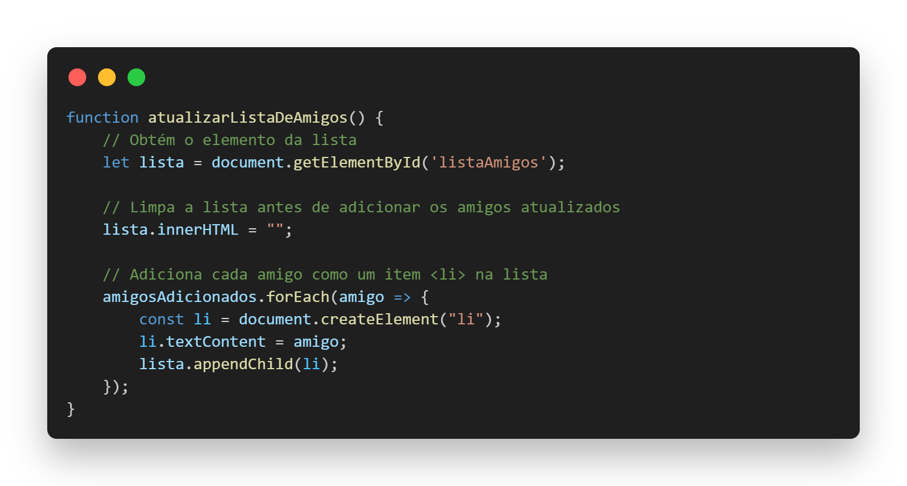

# Amigo Secreto

Este projeto é uma aplicação simples para sorteio de "Amigo Secreto", onde você pode adicionar amigos a uma lista e sortear aleatoriamente um amigo secreto. O projeto utiliza HTML, CSS e JavaScript para sua implementação.

## Funcionalidades

- **Adicionar Amigos**: Adicione amigos à lista de amigos secretos.
- **Exibir Lista de Amigos**: A lista de amigos será exibida e atualizada conforme novos amigos forem adicionados.
- **Sortear Amigo Secreto**: Realize o sorteio de um amigo secreto de forma aleatória.
- **Ocultar Lista**: Após o sorteio, a lista de amigos será ocultada, mostrando apenas o resultado.
- **Validação de Entrada**: A aplicação valida se o campo de nome foi preenchido corretamente e evita a adição de nomes duplicados.

## Como Usar

1. **Adicionar Amigos**:
   - Digite o nome de um amigo no campo de input e clique no botão **Adicionar**.
   - A lista será automaticamente atualizada com o novo nome.

2. **Sortear Amigo Secreto**:
   - Clique no botão **Sortear Amigo** para realizar o sorteio.
   - O nome do amigo secreto sorteado será exibido na tela, e a lista de amigos será ocultada.

## Tecnologias Utilizadas

- **HTML**: Estruturação do conteúdo da página.
- **CSS**: Estilo visual e layout da página.
- **JavaScript**: Lógica para adicionar amigos, realizar o sorteio e atualizar a interface.

